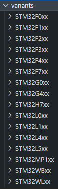
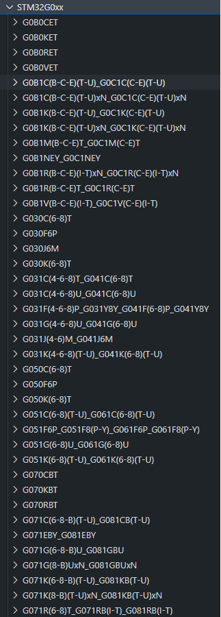
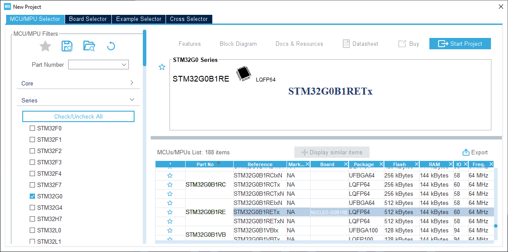
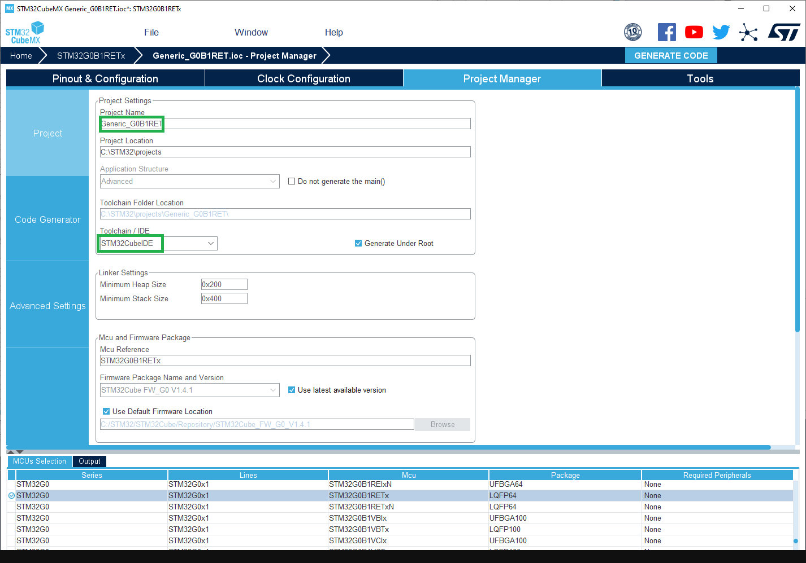
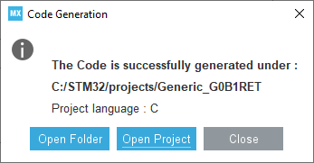
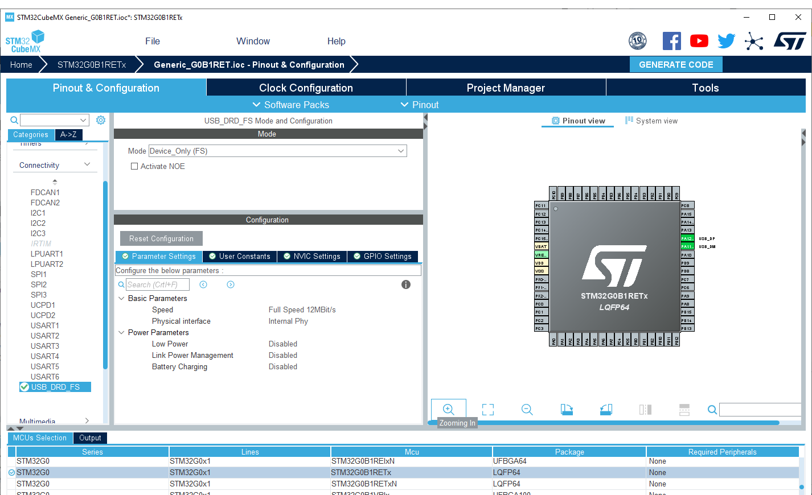

# What is a variant?

It is described by Arduino [here](https://arduino.github.io/arduino-cli/latest/platform-specification/#core-variants)

> A core variant folder is an additional folder that is compiled together with the core and allows platform developers to easily add specific configurations.
>
> Variants must be placed inside the variants folder in the current architecture.

Since STM32 core release 2.0.0 [`variants` folder] contains one folder for each STM32 MCU family.

<details>
  <summary><i>Variants folders</i></summary>

   
</details>

Each MCU family has several MCU references. Each subfolder name can contain one or more mcu reference(s).

<details>
  <summary><i>STM32G0xx family example</i></summary>
  
   
</details>


MCU name are factorized to avoid long path names, for example:

[`G0B1R(B-C-E)T_G0C1R(C-E)T`] is for `G0B1RBT`, `G0B1RCT`, `G0B1RET`, `G0C1RCT` and `G0C1RET`.

All generic variants are now automatically generated in the variant folder thanks the [STM32_open_pin_data] repository which provides all the information required for the pin configuration of products based on STM32 MCU.

This means that the generic STM32 MCU files required for a variant are generated inside each mcu folder. Only the linker script and the system clock configuration are not automatically generated and required to be added manually.

### Generated variant files

 **Below files are automatically generated so do not modify them. Only the `generic_clock.c` can be modified to add default system clock configuration and so will not be overridden.**

 * `board_entry.txt`: contains generic variant declaration to ease board addition in the [`boards.txt`] file. See [Arduino boards.txt specification].
 * `generic_clock.c`: contains the default system clock configuration: `WEAK void SystemClock_Config(void)`
 * `PinNamesVar.h`: contains specific [`PinName`] definitions of the MCU
 * `PeripheralPins.c`: contains list of available [`PinName`] per peripheral.
 * `variant_generic.cpp`: contains Digital PinName array and Analog (`Ax) [pin number] array
 * `variant_generic.h`: contains all definition required by the variant: STM32 [pin number] definitions, peripheral pins for default instances: Serial, I2C, SPI, Tone, Servo, ...

 The example of all the steps below are available in this PR: [Add generic G0B1R(B-C-E)T, G0C1R(C-E)T and Nucleo-G0B1RE ](https://github.com/stm32duino/Arduino_Core_STM32/pull/1398)

---
# Define a new generic variant

Before adding a specific board, it is a good practice to add the generic entry of the STM32 MCU as it is possible to use it with the specific board.

 A folder name can reference several MCU references so several boards entry could be added. Not only the one of the specific board.

## 1 - Find the MCU folder

Go to the [`variants` folder] folder of the STM32 core (See [Where are sources]).

**Example**: To add variant for the [Nucleo-G0B1RE] search for the folder name including `G0B1RET` reference in the STM32G0xx subfolder of the [`variants` folder]. In this case:

[`G0B1R(B-C-E)T_G0C1R(C-E)T`]

Several files are present as stated [here](https://github.com/stm32duino/wiki/wiki/Add-a-new-variant-%28board%29#Generated-variant-files).
It misses only the default linker script named `ldscript.ld`.

## 2 - Add the default linker script

It could be generated thanks [STM32CubeMX].

1. Open [STM32CubeMX] then create a **_New Project_** and select the targeted MCU. In this example the `STM32G0B1RET`:

<details>
  <summary><i>Create new CubeMX project...</i></summary>


</details>

2. Configure the project thanks the **_Project Manager_** tab:

 * Set a project name
 * Set a project location
 * Select the IDE: _**STM32CubeIDE**_

<details>
  <summary><i>Configure the project...</i></summary>


</details>

3. Generate the code by clicking on **_ Generate Code_** button and open the folder

<details>
  <summary><i>Generate the project...</i></summary>


</details>

4. Copy the `STM32YYxxxxxx_FLASH.ld` generated by [STM32CubeMX] in the variant folder and rename it: `ldscript.ld`

**Example** for the [Nucleo-G0B1RE]: `STM32G0B1RETX_FLASH.ld`

In order to have a common linker script for all MCU the `RAM` and `FLASH` definitions have to be updated.
As the linker script is preprocessed it is possible to use some definitions based on board entry and defined by the [`platform.txt`].

``` 
-Wl,--defsym=LD_FLASH_OFFSET={build.flash_offset} -Wl,--defsym=LD_MAX_SIZE={upload.maximum_size} -Wl,--defsym=LD_MAX_DATA_SIZE={upload.maximum_data_size}
```

 * `LD_FLASH_OFFSET`: Flash base offset mainly used when a custom bootloader is used. Default set to 0.
 * `LD_MAX_DATA_SIZE`: RAM size 
 * `LD_MAX_SIZE`: Flash size


```patch
 /* Memories definition */
 MEMORY
 {
-  RAM    (xrw)    : ORIGIN = 0x20000000,   LENGTH = 144K
-  FLASH    (rx)    : ORIGIN = 0x8000000,   LENGTH = 512K
+  RAM    (xrw)    : ORIGIN = 0x20000000,   LENGTH = LD_MAX_DATA_SIZE
+  FLASH    (rx)    : ORIGIN = 0x8000000 + LD_FLASH_OFFSET, LENGTH = LD_MAX_SIZE - LD_FLASH_OFFSET
 }
```
## 3 - Generic System Clock configuration

`generic_clock.c` contains the default system clock configuration which is empty by default. So the default clock
at reset will be used as stated by the warning:

```c
WEAK void SystemClock_Config(void)
{
  /* SystemClock_Config can be generated by STM32CubeMX */
#warning "SystemClock_Config() is empty. Default clock at reset is used."
}
```

 For generic board the internal clock is used: `HSI`. 

[STM32CubeMX]`is also used to generate it.

1. Go to **_Pinout_** tab, enable the desired peripherals: `I2C`, `SDIO`, `SPI`, `USB`, ...
In this example only `USB` needs to be enabled as other peripherals default clock are correct by default.

<details>
  <summary><i>Pinout configuration...</i></summary>


</details>

2. Configure the clock:
   * Set `PLL Source Mux` to `HSI`.
   * Set `HCLK` to the maximum frequency, [STM32CubeMX] will automatically configure the clock tree and resolve conflict if any.
3. Generate the code by clicking on **_ Generate Code_** button and open the folder

<details>
  <summary><i>Generate the project...</i></summary>


</details>

4. In the `generic_clock.c` replace the body of the `SystemClock_Config(void)` by the one generated in `src/main.c` of the generated project.

<details>
  <summary><i>Example</i></summary>

```patch
 WEAK void SystemClock_Config(void)
 {
-  /* SystemClock_Config can be generated by STM32CubeMX */
-#warning "SystemClock_Config() is empty. Default clock at reset is used."
+  RCC_OscInitTypeDef RCC_OscInitStruct = {};
+  RCC_ClkInitTypeDef RCC_ClkInitStruct = {};
+  RCC_PeriphCLKInitTypeDef PeriphClkInit = {};
+
+  /** Configure the main internal regulator output voltage
+  */
+  HAL_PWREx_ControlVoltageScaling(PWR_REGULATOR_VOLTAGE_SCALE1);
+  /** Initializes the RCC Oscillators according to the specified parameters
+  * in the RCC_OscInitTypeDef structure.
+  */
+  RCC_OscInitStruct.OscillatorType = RCC_OSCILLATORTYPE_HSI | RCC_OSCILLATORTYPE_HSI48;
+  RCC_OscInitStruct.HSIState = RCC_HSI_ON;
+  RCC_OscInitStruct.HSI48State = RCC_HSI48_ON;
+  RCC_OscInitStruct.HSIDiv = RCC_HSI_DIV1;
+  RCC_OscInitStruct.HSICalibrationValue = RCC_HSICALIBRATION_DEFAULT;
+  RCC_OscInitStruct.PLL.PLLState = RCC_PLL_ON;
+  RCC_OscInitStruct.PLL.PLLSource = RCC_PLLSOURCE_HSI;
+  RCC_OscInitStruct.PLL.PLLM = RCC_PLLM_DIV1;
+  RCC_OscInitStruct.PLL.PLLN = 8;
+  RCC_OscInitStruct.PLL.PLLP = RCC_PLLP_DIV2;
+  RCC_OscInitStruct.PLL.PLLQ = RCC_PLLQ_DIV2;
+  RCC_OscInitStruct.PLL.PLLR = RCC_PLLR_DIV2;
+  if (HAL_RCC_OscConfig(&RCC_OscInitStruct) != HAL_OK) {
+    Error_Handler();
+  }
+  /** Initializes the CPU, AHB and APB buses clocks
+  */
+  RCC_ClkInitStruct.ClockType = RCC_CLOCKTYPE_HCLK | RCC_CLOCKTYPE_SYSCLK
+                                | RCC_CLOCKTYPE_PCLK1;
+  RCC_ClkInitStruct.SYSCLKSource = RCC_SYSCLKSOURCE_PLLCLK;
+  RCC_ClkInitStruct.AHBCLKDivider = RCC_SYSCLK_DIV1;
+  RCC_ClkInitStruct.APB1CLKDivider = RCC_HCLK_DIV1;
+
+  if (HAL_RCC_ClockConfig(&RCC_ClkInitStruct, FLASH_LATENCY_2) != HAL_OK) {
+    Error_Handler();
+  }
+  /** Initializes the peripherals clocks
+  */
+  PeriphClkInit.PeriphClockSelection = RCC_PERIPHCLK_USB;
+  PeriphClkInit.UsbClockSelection = RCC_USBCLKSOURCE_HSI48;
+  if (HAL_RCCEx_PeriphCLKConfig(&PeriphClkInit) != HAL_OK) {
+    Error_Handler();
+  }
 }
 ```
</details>

## 4 - Declare the variant
It still to add the menu and add relevant information (Flash and SRAM sizes, ...)

 See [Arduino boards.txt specification] for further options.

Edit [`boards.txt`] file, then:
1. Find the menu part where to add the generic entry. In this example the `GenG0` menu.
2. Copy the all the boards entry from the `board_entry.txt` file to this section. Pay attention to alphabetical order.
3. Check if the `build.product_line=` is correct and match the `STM32YYXXxx` MCU version.
4. Check the `upload.maximum_size=` and `upload.maximum_data_size=`


<details>
  <summary><i>Example</i></summary>

```patch
 GenG0.menu.pnum.GENERIC_G081RBTX.build.variant=STM32G0xx/G071R(6-8)T_G071RB(I-T)_G081RB(I-T)
 
+# Generic G0B1RBTx
+GenG0.menu.pnum.GENERIC_G0B1RBTX=Generic G0B1RBTx
+GenG0.menu.pnum.GENERIC_G0B1RBTX.upload.maximum_size=131072
+GenG0.menu.pnum.GENERIC_G0B1RBTX.upload.maximum_data_size=147456
+GenG0.menu.pnum.GENERIC_G0B1RBTX.build.board=GENERIC_G0B1RBTX
+GenG0.menu.pnum.GENERIC_G0B1RBTX.build.product_line=STM32G0B1xx
+GenG0.menu.pnum.GENERIC_G0B1RBTX.build.variant=STM32G0xx/G0B1R(B-C-E)T_G0C1R(C-E)T
+
+# Generic G0B1RCTx
+GenG0.menu.pnum.GENERIC_G0B1RCTX=Generic G0B1RCTx
+GenG0.menu.pnum.GENERIC_G0B1RCTX.upload.maximum_size=262144
+GenG0.menu.pnum.GENERIC_G0B1RCTX.upload.maximum_data_size=147456
+GenG0.menu.pnum.GENERIC_G0B1RCTX.build.board=GENERIC_G0B1RCTX
+GenG0.menu.pnum.GENERIC_G0B1RCTX.build.product_line=STM32G0B1xx
+GenG0.menu.pnum.GENERIC_G0B1RCTX.build.variant=STM32G0xx/G0B1R(B-C-E)T_G0C1R(C-E)T
+
+# Generic G0B1RETx
+GenG0.menu.pnum.GENERIC_G0B1RETX=Generic G0B1RETx
+GenG0.menu.pnum.GENERIC_G0B1RETX.upload.maximum_size=524288
+GenG0.menu.pnum.GENERIC_G0B1RETX.upload.maximum_data_size=147456
+GenG0.menu.pnum.GENERIC_G0B1RETX.build.board=GENERIC_G0B1RETX
+GenG0.menu.pnum.GENERIC_G0B1RETX.build.product_line=STM32G0B1xx
+GenG0.menu.pnum.GENERIC_G0B1RETX.build.variant=STM32G0xx/G0B1R(B-C-E)T_G0C1R(C-E)T
+
+# Generic G0C1RCTx
+GenG0.menu.pnum.GENERIC_G0C1RCTX=Generic G0C1RCTx
+GenG0.menu.pnum.GENERIC_G0C1RCTX.upload.maximum_size=262144
+GenG0.menu.pnum.GENERIC_G0C1RCTX.upload.maximum_data_size=147456
+GenG0.menu.pnum.GENERIC_G0C1RCTX.build.board=GENERIC_G0C1RCTX
+GenG0.menu.pnum.GENERIC_G0C1RCTX.build.product_line=STM32G0C1xx
+GenG0.menu.pnum.GENERIC_G0C1RCTX.build.variant=STM32G0xx/G0B1R(B-C-E)T_G0C1R(C-E)T
+
+# Generic G0C1RETx
+GenG0.menu.pnum.GENERIC_G0C1RETX=Generic G0C1RETx
+GenG0.menu.pnum.GENERIC_G0C1RETX.upload.maximum_size=524288
+GenG0.menu.pnum.GENERIC_G0C1RETX.upload.maximum_data_size=147456
+GenG0.menu.pnum.GENERIC_G0C1RETX.build.board=GENERIC_G0C1RETX
+GenG0.menu.pnum.GENERIC_G0C1RETX.build.product_line=STM32G0C1xx
+GenG0.menu.pnum.GENERIC_G0C1RETX.build.variant=STM32G0xx/G0B1R(B-C-E)T_G0C1R(C-E)T
+
 # Upload menu
 ```
</details>

## 5 - Add new reference to the [`README.md`]

Finally, all the new reference have to be added in the [`README.md`]

<details>
  <summary><i>Example</i></summary>

```patch
 | :green_heart: | STM32G081RB | Generic Board | *2.0.0* |  |
+| :yellow_heart: | STM32G0B1RB<br>STM32G0B1RC<br>STM32G0B1RE | Generic Board | **2.1.0** |  |
+| :yellow_heart: | STM32G0C1RB<br>STM32G0C1RE | Generic Board | **2.1.0** |  |
 
 ### Generic STM32G4 boards
 ```
</details>

## 6 - Restart
Restart Arduino IDE and try one of the new entry with the [CheckVariant example].

---
# Define a specific board


[`boards.txt`]: https://github.com/stm32duino/Arduino_Core_STM32/blob/master/boards.txt
[`G0B1R(B-C-E)T_G0C1R(C-E)T`]: https://github.com/stm32duino/Arduino_Core_STM32/tree/master/variants/STM32G0xx/G0B1R(B-C-E)T_G0C1R(C-E)T
[`PinName`]: tbd
[`platform.txt`]: https://github.com/stm32duino/Arduino_Core_STM32/blob/master/platform.txt
[`variants` folder]: https://github.com/stm32duino/Arduino_Core_STM32/tree/master/variants
[Arduino boards.txt specification]: https://arduino.github.io/arduino-cli/latest/platform-specification/#boardstxt
[CheckVariant example]: https://github.com/stm32duino/STM32Examples/tree/master/examples/NonReg/CheckVariant
[Nucleo-G0B1RE]: https://www.st.com/en/evaluation-tools/nucleo-g0b1re.html
[`README.md`]: https://github.com/stm32duino/Arduino_Core_STM32/blob/master/README.md
[STM32_open_pin_data]: https://github.com/STMicroelectronics/STM32_open_pin_data
[STM32CubeMX]: http://www.st.com/en/development-tools/stm32cubemx.html
[Where are sources]: https://github.com/stm32duino/wiki/wiki/Where-are-sources#stm32-core-sources-files-location